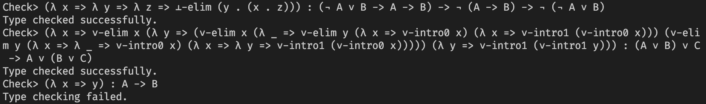

# hsProust

A Haskell implementation of Proust, an interactive proof assistant for [intuitionistic propositional logic ](https://plato.stanford.edu/entries/logic-intuitionistic/) described in the online textbook 
[*Logic and Computation Interwined*](https://cs.uwaterloo.ca/~plragde/flaneries/LACI/index.html) by Prabhakar Ragde. The deductive system we
adopt is given in Chapter 2.

# Syntax
Operators associate to the left, except for λ and →, which are right associative.
## Grammar for proof terms
```
expr = λ x ⇒ expr
     | expr : t
     | expr . expr // . is to make parsing easier
     | ∧-intro expr expr
     | ∧-elim0 expr expr
     | ∧-elim1 expr expr 
     | ∨-intro0 expr expr
     | ∨-intro1 expr expr
     | ∨-elim expr expr expr 
     | ⊥-elim expr
     | ?
     | x
```

## Grammar for types
```
t = t → t
  | t ∨ t
  | t ∧ t
  | ¬ t
  | ⊥
  | x
 ```

# Demo
*Check validity of proof terms:*


*Interactively proving:*


The interactive part is still work in progress. The second demo is made with Proust.

# Build & Run
``` bash
$ cabal build
$ cabal run
```
